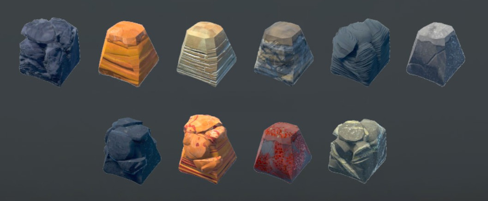
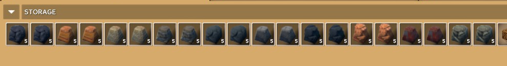
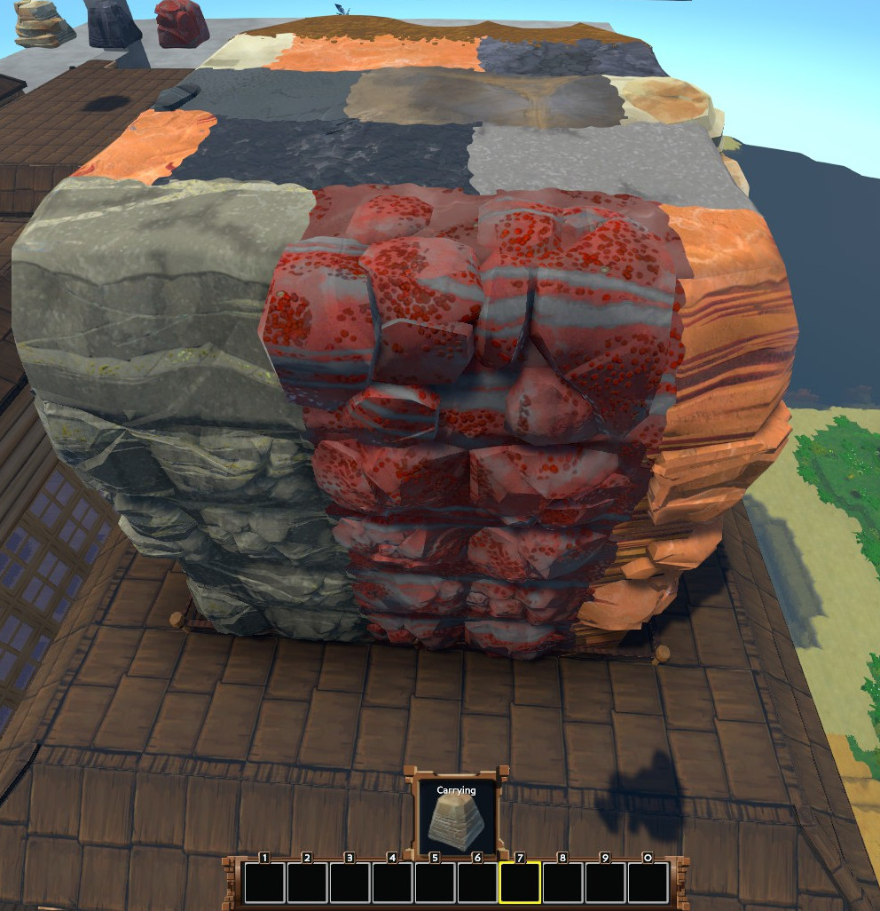

# Eco mod for craftable, placeable Stone
This mod adds an Item for each Stone type that allows placing the naturaly occuring variant of that stone. Additionally they can be crafted in a MasonryTable if you're Mining level 5.

## Disclaimer
The Icons where created from in-game screenshots. The MIT license might not apply to those.
Starting the server/world without the mod will cause all Raw Stone in Stockpiles and Inventories to disappear, but placed Raw Stone will stay.

## Known working game versions
- Beta 0.9.7.13

## Installation using a release
Download the release, unzip it and put the PlaceableStone folder in `Eco_Data\Server\Mods\UserCode`.

## Installation from source
- Build bundle in unity with `build/PlaceableStone` as the target directory.
- Run the `generate.sh` script (warning, this deletes the unity file).
- Copy the builds/PlaceableStone folder to `Eco_Data\Server\Mods\UserCode` and restart the server.

## Screenshots

